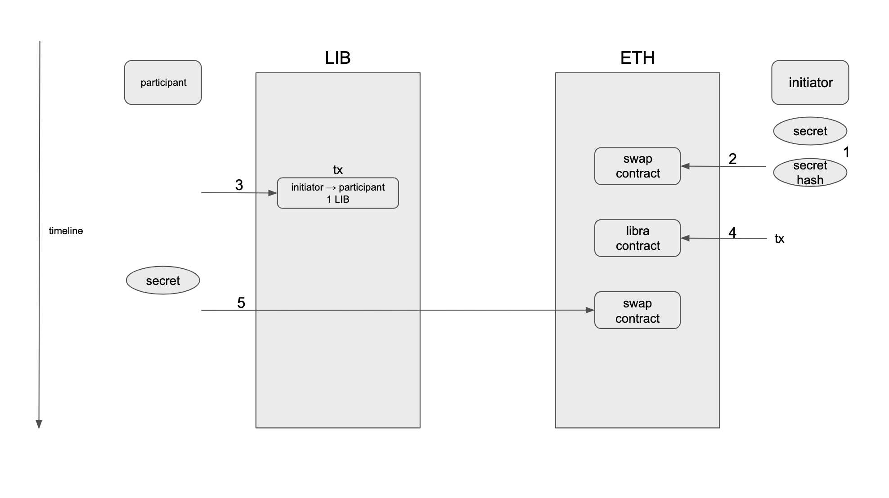

# LibraSwap MVP

## Problem statement

LibraSwap LIB ↔ ETH

Precondition:

1. A has 1 LIB
2. B has 1 ETH
3. A wants to exchange 1 LIB for B's 1 ETH

Result:

1. A will get 1 ETH
2. B will get 1 LIB

### Limitation on Libra

- Move language is limited and premature

### Our approach

Due to the reason that Libra is still at an early stage and Move is under development, we can not deploy and interact with the libra contract. We implement a unilateral Libra swap instead of the standard atomic swap. In our implementation, we have two roles, an initiator and a participant. Participant is the one who has LIB tokens and he wants to trade his LIB tokens for initiator's ETH. Initiator, by contrast, is like an ETH merchant.

At the beginning of the swap process, initiator will generate a secret and locks ETH to the swap contract protected by the secret. Participant could redeem the funds as long as the secret is known. If a period of time (e.g 10 minutes) expires and the funds still have not be redeemed by the participant, the fund could be refunded back to initiator.
Then, participant will transfer LIB tokens to initiator's Libra account. After the transaction has been mined, participant could provide the transaction information to initiator for validation. If the transaction passes the validation (e.g merkle proof and transaction signature), initiator could give participant the secret privately.
Last, with the real secret, participant could finally claim the locked ETH in the swap contract.

In conclusion, the process is shown below:

1. Initiator generates a secret
2. Initiator establishes a swap and locks ETH in it
3. Participant transfers LIB to initiator
4. Initiator validates the transaction, and if it's valid, initiator provides the secret to participant
5. Participant redeems ETH


## Command
```
Commands:
  deploy_contract
  generate_secret
  initiate --from=<from> --to=<to> --hashed_secret=<hashed_secret>
  transfer_lib --from=<from> --to=<to> --amount=<amount>
  verify_lib_tx --from=<from> --to=<to> --from_sequence=<from_sequence>
  redeem --account=<account> --secret=<secret>
```
**deploy_contract**

This is a one-time setup. It will deploy two contracts to ganache. One is Libra contract which will validate the merkle proof of provided Libra transaction. Another one is swap contract which will be responsible for locking and redeeming ETH. After deployment, the two contract addresses will be saved to `config.json` file.

**generate_secret**

This action helps **initiator** generates a random secret.

**initiate --from=\<from> --to=\<to> --hashed_secret=\<hashed_secret>**

This action helps **initiator** launch a new swap. Initiator needs to provide the receiver and the hash of secret to protect the locked ETH. Anyone who has the secret could redeem the funds.

**transfer_lib --from=\<from> --to=\<to> --amount=\<amount>**

This action helps **participant** transfer LIB token to initiator. Before performing this action, participant needs to ensure having enough LIB balance.

**verify_lib_tx --from=\<from> --to=\<to> --from_sequence=\<from_sequence>**

This action helps **initiator** verify the transaction. Under the hood, this verification will validate the merkle proof of a Libra transaction and the transaction signature. Also, it will check the transaction events to make sure the transaction execution to be successful. Futhermore, it will pass the transaction information to Libra contract for validation, although it's not necessary in this scenario.

After the validation, **initiator** should provide the secret to **participant** privately.

**redeem --account=\<account> --secret=\<secret>**

This action helps **participant** redeem locked ETH. With the secret, participant should redeem the funds before the swap expired.

## Example
### Prerequisite

- Python v3.7.4
- [Solidity v0.5.11](https://solidity.readthedocs.io/en/v0.5.11/installing-solidity.html)
- [Ganache-cli](https://github.com/trufflesuite/ganache-cli)
- [Libra core](https://github.com/libra/libra/tree/testnet)
- [Truffle](https://github.com/trufflesuite/truffle) (for testing)

### Customized Libra core
Since Libra use sha3-256 as its default hash function, and Ethereum doesn't support it inherently, we chose to customize Libra core to use keccak-256. After cloning Libra project, you need to modify some lines of code before execution.

On the other hand, since the development of Libra iterates very quickly, you need to fix the version to prevent possible unexpected failure. Here, we specify the version of testnet.
```shell
$ git clone https://github.com/libra/libra
$ cd libra
$ git checkout 3dc03ffd
$ vim crypto/crypto/src/hash.rs
```
Search all `new_sha3_256()` and replace them with `new_keccak256()`. It should be 4 of it.

### Setup

1. Run a local Libra validator
> Reference: https://developers.libra.org/docs/reference/libra-cli#run-a-local-libra-network-and-spawn-a-cli-client
```shell
$ cargo run -p libra_swarm -- -s
```

2. Run Ganache-cli
```shell
$ ganache-cli -m 'praise alarm subway sign pumpkin shock home sail rabbit finger traffic card'
```

3. Change the RPC server in config

Find `config.json` file and change the value of `RPC_SERVER`.

4. Mint LIB to participant's address manually
```
> account mint b12f622546592ad91ac6d20c77053a4720f391ea349facfb95628b22e1a28627 100
```

### Execution

Assume there are two parties, A (participant) and B (initiator). And A wants to trade its LIB for B's ETH. Also, for simplicity, this program will create A's ETH address, A's LIB address, B's ETH address, and B's LIB address automatically.

Step 1: Deploy Libra and swap contract
```shell
$ python run.py deploy_contract
Deploy AtomicSwap.sol to "0xe8e7210B78379b6978e35e6f5156205b6B4018a3"
Deploy Libra.sol to "0x8382A0e1ab9917Ed92D8b8Fc7002ba40f8607698"
```
Setup. Deploy Libra contract and swap contract.

Step 2: B generates a secret
```shell
$ python run.py generate_secret --demo
Secret: 9cd4b55d7aae8239
Hashed secret: 069c6c04531c8439b674fa23ad283e884b9e2f4bc26b329ed2944a7c21570ccb
```
B generates a secret and its hash. B should keep the secret in private.

Step 3: B initiates a swap.
```shell
$ python run.py initiate --from=B --to=A --hashed_secret=069c6c04531c8439b674fa23ad283e884b9e2f4bc26b329ed2944a7c21570ccb

A's LIB address: 1fc7a4b236e6f6a1f4b63dd1d15a8415c5aed258bc7c6b4d3dbe8f15104b0e92 (100.0)
B's LIB address: 9b17f87e511f97e1dc4e5cde4aa94d7b94c25534110c26c97ce6189735582fc0 (0.0)
A's ETH balance: 0x30F7A604B04e49440fBAD299698c16766a2c1Cbd (100)
B's ETH balance: 0xe9b48dd32B9DA77e39Cdf6cDc1024b65da572C09 (100)

account B initiates a transaction with hashedSecret 069c6c04531c8439b674fa23ad283e884b9e2f4bc26b329ed2944a7c21570ccb to account A

A's LIB address: 1fc7a4b236e6f6a1f4b63dd1d15a8415c5aed258bc7c6b4d3dbe8f15104b0e92 (100.0)
B's LIB address: 9b17f87e511f97e1dc4e5cde4aa94d7b94c25534110c26c97ce6189735582fc0 (0.0)
A's ETH balance: 0x30F7A604B04e49440fBAD299698c16766a2c1Cbd (100)
B's ETH balance: 0xe9b48dd32B9DA77e39Cdf6cDc1024b65da572C09 (98.99731162)
```
B specifies the future recipient (A), provides the hashed of the secret, and locks 1 ETH in the swap contract. Within a short period (e.g 10 minutes), A could send 1 LIB to B to claim the locked 1 ETH.

Step 4: A transfers 1 LIB to B
```shell
$ python run.py transfer_lib --from=A --to=B --amount=1
A's LIB address: 1fc7a4b236e6f6a1f4b63dd1d15a8415c5aed258bc7c6b4d3dbe8f15104b0e92 (100.0)
B's LIB address: 9b17f87e511f97e1dc4e5cde4aa94d7b94c25534110c26c97ce6189735582fc0 (0.0)
A's ETH balance: 0x30F7A604B04e49440fBAD299698c16766a2c1Cbd (100)
B's ETH balance: 0xe9b48dd32B9DA77e39Cdf6cDc1024b65da572C09 (98.99731162)

Transaction has been sent from account A with sequence 0

A's LIB address: 1fc7a4b236e6f6a1f4b63dd1d15a8415c5aed258bc7c6b4d3dbe8f15104b0e92 (99.0)
B's LIB address: 9b17f87e511f97e1dc4e5cde4aa94d7b94c25534110c26c97ce6189735582fc0 (1.0)
A's ETH balance: 0x30F7A604B04e49440fBAD299698c16766a2c1Cbd (100)
B's ETH balance: 0xe9b48dd32B9DA77e39Cdf6cDc1024b65da572C09 (98.99731162)
```

Step 5: B verifies the Libra transaction
```shell
$ python run.py verify_lib_tx --from=A --to=B --from_sequence=0
Libra transaction has passed the contract validation, tx hash: 0xb6fb73021ac87e98d17f4b1c822783aeffd5ddfc2089233e33605152f015b867
Now, account A can send secret to account B privately
```
After this step, if it's successful, B should provide the secret to A privately.

Step 6: A redeems 1 ETH with secret
```shell
$ python run.py redeem --account=A --secret=9cd4b55d7aae8239
A's LIB address: 1fc7a4b236e6f6a1f4b63dd1d15a8415c5aed258bc7c6b4d3dbe8f15104b0e92 (99.0)
B's LIB address: 9b17f87e511f97e1dc4e5cde4aa94d7b94c25534110c26c97ce6189735582fc0 (1.0)
A's ETH balance: 0x30F7A604B04e49440fBAD299698c16766a2c1Cbd (99.9992596)
B's ETH balance: 0xe9b48dd32B9DA77e39Cdf6cDc1024b65da572C09 (98.99731162)

Account A redeems successfully

A's LIB address: 1fc7a4b236e6f6a1f4b63dd1d15a8415c5aed258bc7c6b4d3dbe8f15104b0e92 (99.0)
B's LIB address: 9b17f87e511f97e1dc4e5cde4aa94d7b94c25534110c26c97ce6189735582fc0 (1.0)
A's ETH balance: 0x30F7A604B04e49440fBAD299698c16766a2c1Cbd (100.99859138)
B's ETH balance: 0xe9b48dd32B9DA77e39Cdf6cDc1024b65da572C09 (98.99731162)
```
