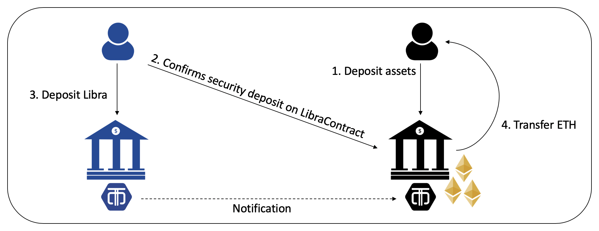
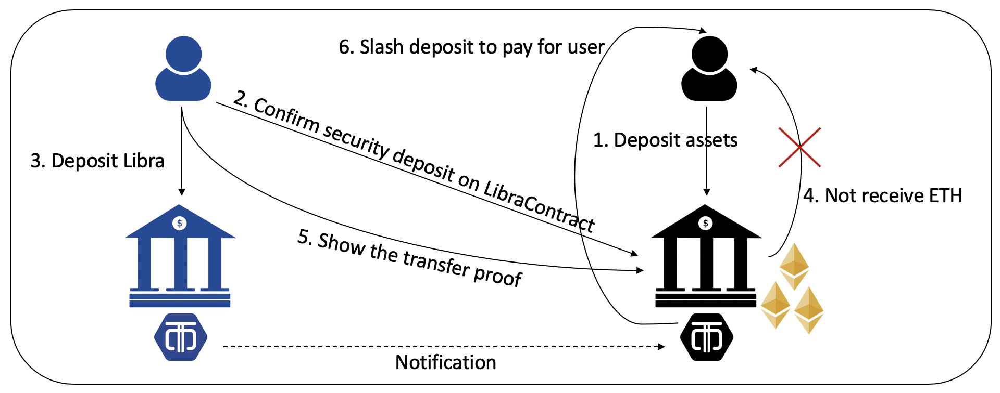

# LibraBridge MVP

## Problem statement

If we want to realize atomic swap between Libra and Ethereum, we need both blockchains to support Hash Timelock Contracts (HTLC). Though Libra claims it supports smart contract, it’s still under development and the user currently cannot deploy contract on chain. Hence, in our LibraSwap article, we assume that coin swap happens correctly if there is a trusted third party but this design is far away from decentralization. Nevertheless, we still can build a **trustless custodian** by protocol design and SPV proof.

For example, I have a Libra token but want to exchange LIB for ETH. An exchange, called MAX, provides a LIB-ETH pair exchange so I can trade on the platform. So the easiest way is to deposit LIB on MAX and get ETH back under the assumption if I trust the service provider, MAX.

So the question becomes if we want to do token exchange, can we achieve it without trusting MAX?

### Our approach

In our implementation, we have two roles, a custodian and a participant. Participant is the one who has LIB tokens and he wants to trade his LIB tokens for custodian's ETH. Custodian, by contrast, is like an ETH merchant.

First, we can use Libra SPV proof to verify a Libra transaction. By implementing Libra SPV proof in smart contract, we can communicate to contract for verifying Libra transaction directly. Next, we require two methods **deposit** and **challenge** to make custodian trustworthy. The idea is custodian needs to put the deposit in the contract, and the contract acts as an escrow to complete the trade. Once custodian misbehaves by not transferring ETH to the participant, the participant can use challenge function to prove the Libra transaction happen.

The process is shown below:

#### Normal Case:

1. Custodian deposits some funds and specifies the beneficiary.
2. Participant queries the deposit to check if the beneficiary is right and has enough funds.
3. Participant transfers 1 LIB to custodian.
4. Custodian validates the transaction, and if it's valid, custodian transfers 1 ETH to participant.



#### Misbehaved Case:

1. Custodian deposits some funds and specifies the beneficiary.
2. Participant queries the deposit to check if the beneficiary is right and has enough funds.
3. Participant transfers 1 LIB to custodian.
4. Custodian doesn't fulfill the commitment.
5. Participant launches a challenge by providing the transaction proof.
6. If the challenge is successful, slash the custodian's deposit to compensate for participant.



## Command
```
Commands:
  deploy_contract
  run.py deposit [--depositor=<depositor>] [--beneficiary=<beneficiary>]
  run.py query_deposit [--deposit_id=<deposit_id>]
  run.py transfer_1_lib [--from=<from>] [--to=<to>]
  run.py transfer_1_eth [--depositor=<depositor>] [--deposit_id=<deposit_id>]
  run.py challenge [--from=<from>] [--from_sequence=<from_sequence>] [--deposit_id=<deposit_id>]
```
**deploy_contract**

This is a one-time setup. It will deploy Libra contract to ganache. After deployment, the contract address will be saved to `config.json` file. This contract contains three functions: **deposit**, **transfer**, and **challenge**.

- deposit: Every deposit action is considered non fungible with a unique deposit ID. It must specify a beneficiary and the amount. Also it will use the current time as the start time and specify the refund time as current time plus 1 hour.
- transfer: Every transfer should be provided a deposit ID and the caller must be the depositor of that deposit. This action will transfer the specified amount of ETH to the beneficiary and refund the remaining locked funds back to the depositor.
- challenge: Every challenge should be provided a deposit ID and the caller must be the beneficiary of that deposit. This action could be used if the depositor doesn't fulfill the commitment. If the challenge is successful, all the locked funds in this deposit will be transferred to participant.

**deposit --depositor=\<depositor> --beneficiary=\<beneficiary>**

This action helps **custodian** create a new deposit. Caller should specify the participant as the beneficiary and it will require 2 ETH as deposit.

**query_deposit --deposit_id=\<deposit_id>**

This action queries a particular deposit record by providing the deposit ID. It helps **participant** to examine if he or she is the beneficiary and if the locked funds are enough for slash.

**transfer_1_lib --from=\<from> --to=\<to>**

This action helps **participant** transfer 1 LIB token to custodian. Before performing this action, participant needs to ensure having enough LIB balance.

**transfer_1_eth --depositor=\<depositor> --deposit_id=\<deposit_id>**

In normal case, if custodian receives LIB token from participant, custodian will transfer the equivalent amount of ETH to participant. This action helps **custodian** transfer 1 ETH token to participant (the beneficiary) and refunds the remaining locked funds. Caller should specify the deposit ID.

**challenge --from=\<from> --from_sequence=\<from_sequence>**

If custodian misbehave by not sending back ETH, this action could be used to help **participant** to launch a challenge. Under the hood, this verification will validate the merkle proof of a Libra transaction. If the validation is successful, it will slash the deposit to compensate participant.

## Example
### Prerequisite

- Python v3.7.4
- [Solidity v0.5.11](https://solidity.readthedocs.io/en/v0.5.11/installing-solidity.html)
- [Ganache-cli](https://github.com/trufflesuite/ganache-cli)
- [Libra core](https://github.com/libra/libra/tree/testnet)
- [Truffle](https://github.com/trufflesuite/truffle) (for testing)

### Customized Libra core
Since Libra use sha3-256 as its default hash function, and Ethereum doesn't support it inherently, we chose to customize Libra core to use keccak-256. After cloning Libra project, you need to modify some lines of code before execution.

On the other hand, since the development of Libra iterates very quickly, you need to fix the version to prevent possible unexpected failure. Here, we specify the version of testnet.
```shell
$ git clone https://github.com/libra/libra
$ cd libra
$ git checkout 3dc03ffd
$ vim crypto/crypto/src/hash.rs
```
Search all `new_sha3_256()` and replace them with `new_keccak256()`. It should be 4 of it.

### Setup

1. Run a local Libra validator
> Reference: https://developers.libra.org/docs/reference/libra-cli#run-a-local-libra-network-and-spawn-a-cli-client
```shell
$ cargo run -p libra_swarm -- -s
```

2. Run Ganache-cli
```shell
$ ganache-cli -m 'praise alarm subway sign pumpkin shock home sail rabbit finger traffic card'
```

3. Change the RPC server in config

Find `config.json` file and change the value of `RPC_SERVER`.

4. Mint LIB to participant's address manually
```
> account mint b12f622546592ad91ac6d20c77053a4720f391ea349facfb95628b22e1a28627 100
```

### Execution

Assume there are two parties, A (participant) and B (custodian). And A wants to trade its LIB for B's ETH. Also, for simplicity, this program will create A's ETH address, A's LIB address, B's ETH address, and B's LIB address automatically.

Step 1: Deploy Libra contract
```shell
$ python run.py deploy_contract
A's LIB address: b12f622546592ad91ac6d20c77053a4720f391ea349facfb95628b22e1a28627 (100.0)
B's LIB address: cff25ea1a9a4733b083bab846a72d85c7722ba499863154157ad1fc8fd2c8e91 (0.0)
A's ETH balance: 0x30F7A604B04e49440fBAD299698c16766a2c1Cbd (100)
B's ETH balance: 0xe9b48dd32B9DA77e39Cdf6cDc1024b65da572C09 (100)

Deploy Libra.sol to "0xe8e7210B78379b6978e35e6f5156205b6B4018a3"

A's LIB address: b12f622546592ad91ac6d20c77053a4720f391ea349facfb95628b22e1a28627 (100.0)
B's LIB address: cff25ea1a9a4733b083bab846a72d85c7722ba499863154157ad1fc8fd2c8e91 (0.0)
A's ETH balance: 0x30F7A604B04e49440fBAD299698c16766a2c1Cbd (100)
B's ETH balance: 0xe9b48dd32B9DA77e39Cdf6cDc1024b65da572C09 (100)
```

Step 2: B deposits and specifies A as beneficiary
```shell
$ python run.py deposit --depositor=B --beneficiary=A
A's LIB address: b12f622546592ad91ac6d20c77053a4720f391ea349facfb95628b22e1a28627 (100.0)
B's LIB address: cff25ea1a9a4733b083bab846a72d85c7722ba499863154157ad1fc8fd2c8e91 (0.0)
A's ETH balance: 0x30F7A604B04e49440fBAD299698c16766a2c1Cbd (100)
B's ETH balance: 0xe9b48dd32B9DA77e39Cdf6cDc1024b65da572C09 (100)

account B deposits 2 ethers to contract with deposit ID 0, and specifies beneficiary to account A

A's LIB address: b12f622546592ad91ac6d20c77053a4720f391ea349facfb95628b22e1a28627 (100.0)
B's LIB address: cff25ea1a9a4733b083bab846a72d85c7722ba499863154157ad1fc8fd2c8e91 (0.0)
A's ETH balance: 0x30F7A604B04e49440fBAD299698c16766a2c1Cbd (100)
B's ETH balance: 0xe9b48dd32B9DA77e39Cdf6cDc1024b65da572C09 (97.99705588)
```
B initiates a new deposit with deposit ID 0. After this action, the ETH balance of B reduced about 2 ETH for the deposit.

Step 3: A checks the deposit.
```shell
$ python run.py query_deposit --deposit_id=0

A's LIB address: b12f622546592ad91ac6d20c77053a4720f391ea349facfb95628b22e1a28627 (100.0)
B's LIB address: cff25ea1a9a4733b083bab846a72d85c7722ba499863154157ad1fc8fd2c8e91 (0.0)
A's ETH balance: 0x30F7A604B04e49440fBAD299698c16766a2c1Cbd (100)
B's ETH balance: 0xe9b48dd32B9DA77e39Cdf6cDc1024b65da572C09 (97.99705588)

depositor: 0xe9b48dd32B9DA77e39Cdf6cDc1024b65da572C09
beneficiary: 0x30F7A604B04e49440fBAD299698c16766a2c1Cbd
amount: 2
start time: 1570189452
refund time: 1570193052

A's LIB address: b12f622546592ad91ac6d20c77053a4720f391ea349facfb95628b22e1a28627 (100.0)
B's LIB address: cff25ea1a9a4733b083bab846a72d85c7722ba499863154157ad1fc8fd2c8e91 (0.0)
A's ETH balance: 0x30F7A604B04e49440fBAD299698c16766a2c1Cbd (100)
B's ETH balance: 0xe9b48dd32B9DA77e39Cdf6cDc1024b65da572C09 (97.99705588)
```
A examines the deposit 0. Notice that the depositor is exactly B's ETH address and the beneficiary is also A's ETH address.

Step 4: A transfers 1 LIB to B
```shell
$ python run.py python run.py transfer_1_lib --from=A --to=B
A's LIB address: b12f622546592ad91ac6d20c77053a4720f391ea349facfb95628b22e1a28627 (100.0)
B's LIB address: cff25ea1a9a4733b083bab846a72d85c7722ba499863154157ad1fc8fd2c8e91 (0.0)
A's ETH balance: 0x30F7A604B04e49440fBAD299698c16766a2c1Cbd (100)
B's ETH balance: 0xe9b48dd32B9DA77e39Cdf6cDc1024b65da572C09 (97.99705588)

Transaction has been sent from account A with sequence 0

A's LIB address: b12f622546592ad91ac6d20c77053a4720f391ea349facfb95628b22e1a28627 (99.0)
B's LIB address: cff25ea1a9a4733b083bab846a72d85c7722ba499863154157ad1fc8fd2c8e91 (1.0)
A's ETH balance: 0x30F7A604B04e49440fBAD299698c16766a2c1Cbd (100)
B's ETH balance: 0xe9b48dd32B9DA77e39Cdf6cDc1024b65da572C09 (97.99705588)
```

Step 5: B transfers 1 ETH to A
```shell
$ python run.py transfer_1_eth --depositor=B --deposit_id=0
A's LIB address: b12f622546592ad91ac6d20c77053a4720f391ea349facfb95628b22e1a28627 (99.0)
B's LIB address: cff25ea1a9a4733b083bab846a72d85c7722ba499863154157ad1fc8fd2c8e91 (1.0)
A's ETH balance: 0x30F7A604B04e49440fBAD299698c16766a2c1Cbd (100)
B's ETH balance: 0xe9b48dd32B9DA77e39Cdf6cDc1024b65da572C09 (97.99705588)

Libra payment is confirmed. B will send 1 ether to beneficiary and get the remaining deposit.

A's LIB address: b12f622546592ad91ac6d20c77053a4720f391ea349facfb95628b22e1a28627 (99.0)
B's LIB address: cff25ea1a9a4733b083bab846a72d85c7722ba499863154157ad1fc8fd2c8e91 (1.0)
A's ETH balance: 0x30F7A604B04e49440fBAD299698c16766a2c1Cbd (101)
B's ETH balance: 0xe9b48dd32B9DA77e39Cdf6cDc1024b65da572C09 (98.9964013)
```
After this step, if it's successful, the exchange is finished.

Step 6: A challenges if step 5 never executed
```shell
$ python run.py challenge --from=A --from_sequence=0 --deposit_id=0
A's LIB address: b12f622546592ad91ac6d20c77053a4720f391ea349facfb95628b22e1a28627 (99.0)
B's LIB address: cff25ea1a9a4733b083bab846a72d85c7722ba499863154157ad1fc8fd2c8e91 (1.0)
A's ETH balance: 0x30F7A604B04e49440fBAD299698c16766a2c1Cbd (100)
B's ETH balance: 0xe9b48dd32B9DA77e39Cdf6cDc1024b65da572C09 (97.99705588)

Account A challenges successfully.

A's LIB address: b12f622546592ad91ac6d20c77053a4720f391ea349facfb95628b22e1a28627 (99.0)
B's LIB address: cff25ea1a9a4733b083bab846a72d85c7722ba499863154157ad1fc8fd2c8e91 (1.0)
A's ETH balance: 0x30F7A604B04e49440fBAD299698c16766a2c1Cbd (101.99925206)
B's ETH balance: 0xe9b48dd32B9DA77e39Cdf6cDc1024b65da572C09 (97.99705588)
```
After challenge, A gets more than 1 ETH and B is punished.
